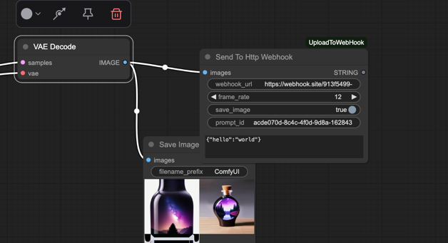

# ComfyUI_UploadToWebHook

[](https://github.com/jerrywap/ComfyUI_UploadToWebhookHTTP/stargazers)




A custom node for [ComfyUI](https://github.com/comfyanonymous/ComfyUI) that allows you to **send generated image(s) or video clips** directly to an HTTP webhook along with optional metadata such as `prompt_id` and `other_data`.

---

## ✨ Features

- 🔗 Upload a single image or video (from image sequence) to a webhook URL
- 📦 Includes `prompt_id` and additional `other_data` as form data
- 🧠 Accepts image tensor input from ComfyUI image nodes
- 🎛️ Optional save toggle to control file persistence (save or temp)
- 📋 Textarea input for passing additional JSON data

---

## 🔧 Installation

1. Clone or download this repo into your `ComfyUI/custom_nodes` directory:

```
cd /workspace/ComfyUI/custom_nodes
git clone https://github.com/yourusername/ComfyUI_UploadToWebHook.git
```

2. Install dependencies:

```
cd ComfyUI_UploadToWebHook
bash install.sh
```

3. Restart ComfyUI (or use the **Reload Custom Nodes** button if available).

---

## 🧩 How to Use

In ComfyUI:

1. Drag your image output (e.g., from `VAE Decode`) to the **Send To Http Webhook** node.
2. Configure:
    - `webhook_url`: The URL that will receive your image or video.
    - `frame_rate`: Only used when sending multiple images as a video.
    - `save_image`: Toggle to control whether to store file permanently.
    - `prompt_id`: (optional) Identifier of your prompt or run.
    - `other_data`: (optional) JSON key-value data sent as extra POST fields.

---

## 🖼️ UI Example


---

## 🧪 Webhook Example

You can test with a free service like [https://webhook.site](https://webhook.site).

- The uploaded image/video appears as `file`.
- Additional fields (`prompt_id`, `other_data`) are sent as part of the POST form data.

---

## 📤 Output Payload

Sample multipart form sent to webhook:

```
POST /your/webhook HTTP/1.1
Content-Type: multipart/form-data

file: image.png / video.mp4
prompt_id: acde070d-8c4c-4f0d-9d8a-162843
other_data: {"hello": "world"}
```

---

## 📁 Folder Structure

```
ComfyUI_UploadToWebHook/
├── __init__.py
├── requirements.txt
└── install.sh
```

---

## 🧑‍💻 Contributing

Pull requests and feature ideas are welcome!  
Feel free to fork and create a PR.

---

## 📄 License

This project is licensed under the MIT License.  
See [LICENSE](./LICENSE) for details.
